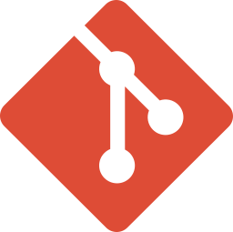

<section id="content">

# <a id="works_ru" href="#works_ru">👨🏻‍💻 Work experience</a>

* ### Python-developer

    *2024-till now. [Community Viribus Unitis](https://github.com/profcomff)*

    I develop microservices for the faculty application in the team.

# <a id="education_ru" href="#education_ru">🎓 Education</a>
   
   (MSU) Lomonosov Moscow State University

# <a id="skills_ru" href="#skills_ru">🛠️ Hard skills</a>

* ### Main stack
    Python, FastAPI, Docker — Backend development.
    

      
      
      
    

* ### Additional stack
    PostgreSQL, HTML, CSS, NumPy, Matplotlib, Pandas, Jupyter Notebook — Development of simple websites, data analysis.
    

       
      
      
      
      
      
      
  

* ### Other
    Git, GitHub — Version control systems.
    

      
      
    

# <a id="projects_ru" href="#projects_ru">🧩 Public projects </a>
Soon they will appear, now everything is in the repositories.

# <a id="contacts_ru" href="#contacts_ru">📧 Контакты</a>
* Telegram: [@commanderChe](https://t.me/commanderChe)
* Mail: [petr8367474@yandex.ru](mailto:petr8367474@yandex.ru)
* Profile on [GitHub](https://github.com/petrCher)

</section>
